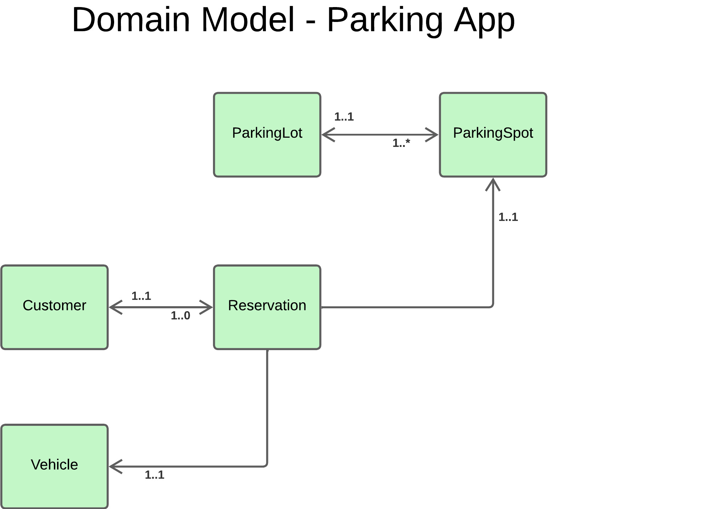
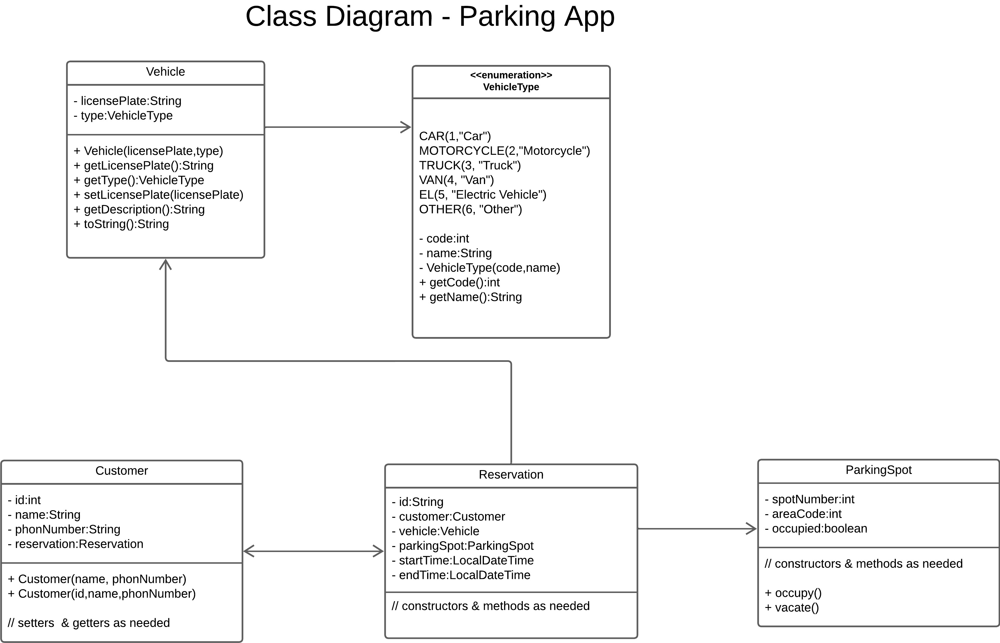

# Parking APP based on OOP concepts

## ParkingSpot
- Represents an **individual parking spot** within a parking lot or parking area.
- **Attributes**:
  - `spotNumber: int` The identifier for the parking spot.
  - `occupied: boolean` Indicates whether the spot is occupied.

###### TODO: Define other objects

## Domain Model

## Class Diagram

